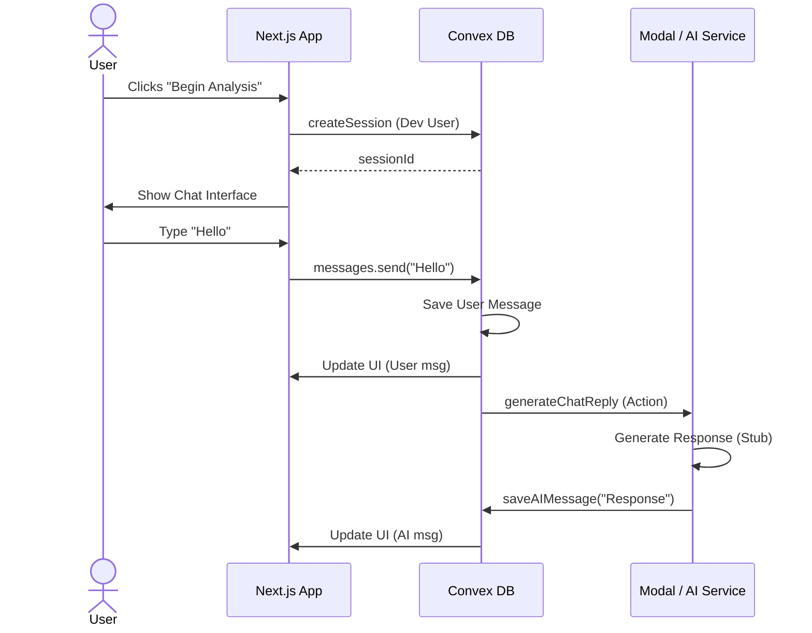

# System Architecture

```mermaid
graph TD
    User[User / Browser]
    
    subgraph "Frontend (Next.js)"
        UI[React UI]
        Chat[Chat Component]
    end
    
    subgraph "Backend (Convex)"
        DB[(Convex DB)]
        Sessions[Sessions Mutation]
        Messages[Messages Mutation]
        Actions[Convex Actions]
    end
    
    subgraph "AI Compute (Modal)"
        Analysis[Analysis Endpoint]
        Transcribe[Transcribe Endpoint]
    end

    User --> UI
    UI --> Chat
    
    Chat -->|1. Send Message| Messages
    Messages -->|2. Store| DB
    
    Messages -.->|3. Trigger AI Reply| Actions
    Actions -.->|4. Call LLM (Pending)| Analysis
```

# User Flow


